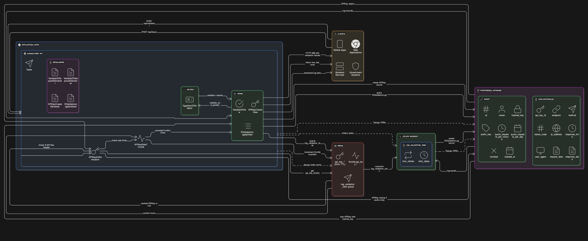

```markdown
# Egyptian National ID Validator API

A robust, production-ready REST API for validating Egyptian National IDs and extracting personal information. Built with Django REST Framework, this service provides secure, scalable validation with comprehensive logging and rate limiting.

## 🚀 Features

- **🔒 Secure Validation**: Comprehensive Egyptian National ID validation with checksum verification
- **📊 Data Extraction**: Parse birth date, gender, governorate, and age from ID numbers
- **🔑 API Key Authentication**: Secure service-to-service authentication with customizable quotas
- **⚡ Rate Limiting**: Dual-layer throttling (per-minute and per-day) with Redis-backed counters
- **📝 Request Logging**: Comprehensive audit trail with async processing
- **🌐 Arabic Support**: Automatic normalization of Arabic numerals
- **🐳 Docker Ready**: Containerized deployment with Docker and Docker Compose

## 🏗️ System Architecture


The system follows a microservices-inspired architecture with clear separation of concerns:


Clients → Django REST API → Redis Cache → PostgreSQL Database
                    ↓
              Celery Workers (Async Logging)


### Core Components
- **Django REST API**: Handles HTTP requests, authentication, and business logic
- **PostgreSQL**: Primary data store for API keys and validation logs
- **Redis**: Caching layer and message broker for async tasks
- **Celery**: Background worker for async log processing
- **Docker**: Containerization for consistent deployment

## 📋 API Endpoints

### 1. Validate National ID
**POST** `/api/v1/validate-id/`

Validate an Egyptian National ID and extract personal information.

**Headers:**
```http
X-API-Key: your_api_key_here
Content-Type: application/json
```

**Request Body:**
```json
{
  "national_id": "30103271701312",
  "strict_checksum": true
}
```

**Success Response (200 OK):**
```json
{
    "valid": true,
    "errors": [],
    "parsed": {
        "raw": "30103271701312",
        "century_digit": "3",
        "birth_date": "2001-03-27",
        "age": 24,
        "governorate_code": "17",
        "governorate_name": "Monufia",
        "serial": "0131",
        "gender": "male",
        "checksum_ok": true
    }
}
```

### 2. Create API Key
**POST** `/api/v1/get_api_key/`

Generate a new API key with customizable quotas.

**Request Body:**
```json
{
  "name": "My Application",
  "quota_requests_per_minute": 100,
  "quota_requests_per_day": 5000
}
```

**Response (201 Created):**
```json
{
    "message": "API key created successfully",
    "api_key": {
        "id": "2e095824-201a-4975-916c-a69f3447525e",
        "name": "My Application",
        "key": "wyHTU39bmvbmvAQvIOT_hSA0hJhffyqQhhVDg-1ydXs",
        "created_at": "2025-10-17T19:09:59.900288Z",
        "quota_requests_per_minute": 60,
        "quota_requests_per_day": 1000,
        "metadata": {}
    }
}
```

> ⚠️ **Important**: The raw API key is only shown once upon creation. Store it securely.


## 🔄 Sequence Diagram

The sequence diagram illustrates the complete flow of a validation request:


## 🔄 System  Architecture 

The sequence diagram illustrates the architecture of the system:




## 🛠️ Installation & Setup

### Prerequisites

- Docker and Docker Compose
- Git

### Quick Start with Docker

1. **Clone the repository**
   ```bash
   git clone https://github.com/abdelfattah27/egyptian-id-validator.git
   cd egyptian-id-validator
   ```

2. **Set up environment variables**
   ```bash
   cp .env.example .env
   ```

3. **Build and start services**
   ```bash
   docker-compose up -d --build
   ```

4. **Run migrations**
   ```bash
   docker-compose exec web python manage.py migrate
   ```

5. **Access the API**
   - Craete API Key: `http://localhost:8000/api/v1/get_api_key/`
   - API Base URL: `http://localhost:8000/api/v1/validate-id/`
   - API Documentation: `http://localhost:8000/swagger/`

### Service Ports
- **API Server**: http://localhost:8000
- **PostgreSQL**: localhost:5432
- **Redis**: localhost:6379
- **Celery Worker**: Background process

## 🔧 Configuration

### Environment Variables

Create a `.env` file with the following variables:

```env
# Django settings
DJANGO_SECRET_KEY=testsecretkey
DJANGO_DEBUG=True
DJANGO_ALLOWED_HOSTS=127.0.0.1,localhost
DJANGO_SETTINGS_MODULE=id_api.settings

# Database
POSTGRES_DB=national_id_db
POSTGRES_USER=admin
POSTGRES_PASSWORD=admin123
POSTGRES_HOST=db
POSTGRES_PORT=5432


# Redis (broker + cache)
CELERY_BROKER_URL=redis://redis:6379/0
CELERY_RESULT_BACKEND=redis://redis:6379/1

# Localization
LANGUAGE_CODE=en-us
TIME_ZONE=Africa/Cairo
CELERY_TIMEZONE=Africa/Cairo

# Redis/Celery Configuration
CELERY_BROKER_URL=redis://redis:6379/0
CELERY_RESULT_BACKEND=redis://redis:6379/0
REDIS_CACHE_LOCATION=redis://redis:6379/1

# Throttling Rates
DEFAULT_THROTTLE_RATE=60/minute
DEFAULT_THROTTLE_RATE_DAILY=1000/day
```

### National ID Validation Rules

The validator performs comprehensive checks:
- **Length**: Exactly 14 digits
- **Format**: Numeric characters (supports Arabic numerals)
- **Century Digit**: Valid century codes (2 for 1900s, 3 for 2000s)
- **Date Validation**: Valid birth date (not in future)
- **Governorate Code**: Known Egyptian governorate codes
- **Checksum**: Luhn-like algorithm validation (optional)

## 🔒 Security Features

### API Key Security

- Keys are hashed before storage
- Raw keys are only returned once during creation
- Prefix-based lookup for efficient authentication
- Redis caching to reduce database load

### Rate Limiting

- **Per-minute limits**: Configurable per API key
- **Daily limits**: Separate daily quota enforcement
- **Redis-backed**: Distributed rate limiting support

### Data Protection

- National IDs are masked in logs (first 8 digits shown)
- Input sanitization and validation
- Secure headers and CORS configuration

## 🧪 Testing

### Run Test Suite
```bash
# Run all tests
docker-compose exec web python manage.py test

```

### Test Categories
- **Unit Tests**: Core validation logic
- **Integration Tests**: API endpoints with authentication
- **Security Tests**: API key validation and rate limiting
- **Performance Tests**: Response time and load handling

## 📊 Monitoring & Logging

### Application Logs

- Async log processing to minimize request impact
- Error tracking and alerting

### Performance Metrics

- Response time tracking
- API key usage analytics
- Rate limit utilization
- Error rate monitoring


## 🐛 Troubleshooting

### Common Issues

1. **API Key Authentication Failed**
   - Verify the `X-API-Key` header is present
   - Check if the API key has been revoked
   - Ensure the key is correctly formatted

2. **Rate Limit Exceeded**
   - Check your current usage against quotas

3. **Validation Errors**
   - Ensure the national ID is exactly 14 digits
   - Check for non-numeric characters
   - Verify the ID follows Egyptian format rules
